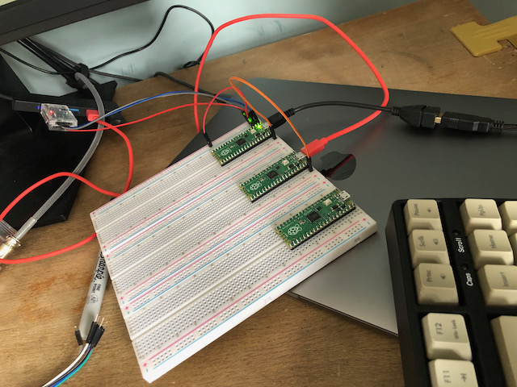

# Raspberry Pi Pico Keyboard and Mouse

This is a minimal example for the Raspberry Pi Pico adapted from the TinyUSB examples at https://github.com/hathach/tinyusb/tree/master/examples/host/cdc_msc_hid

I found the examples a bit confusing, because they're designed to support multiple micro-controllers and seem to presume a lot of knowledge so I stripped out everything I could from the configuration and code and checked that it could accept keyboard and mouse input.

To connect a USB keyboard to the Pico you need to connect a Micro USB OTG adapter to convert the Micro USB socket on the Pico into a full size USB socket. It's the same cable that the Pi Zero uses for keyboard input, e.g. https://uk.pi-supply.com/products/pi-zero-usb-adaptor-usb-otg-host-cable

There's only one USB socket on the Pico, so if you use it as a USB input, then you can't use the USB as a serial output for reading the console, or to power the Pi.

To power the Pi, you can apply power to pin 40 - see pinout at https://www.raspberrypi.org/documentation/rp2040/getting-started/#board-specifications

To read the serial output, instead of using the built-in USB, you can use a USB serial dongle connected to pins 1, 2 and 3 on the Pico. I used https://www.amazon.co.uk/DSD-TECH-adapter-FT232RL-Compatible/dp/B07BBPX8B8/ref=pd_lpo_1?pd_rd_i=B07BBPX8B8&psc=1

With that in place, I could run `minicom` on my computer and see the mouse and keyboard reports from the Pico.

# Build
- `docker build -t pico-build .`
- `docker run --rm -v "$(pwd):/mounted" pico-build`
- You should now have a local `keyboard.uf2` for flashing.

## Code structure

The `main.c` file is the entrypoint of the program. It starts up TinyUSB with `board_init()` and `tusb_init()`, then runs the TinyUSB tasks with `tuh_task()` and the `blink_led_task()` to blink the LED to show that the program is running.

The code related to handling USB input is in `hid_app.c`, this file is included as a source file in the project within the `CMakeLists.txt` file.

